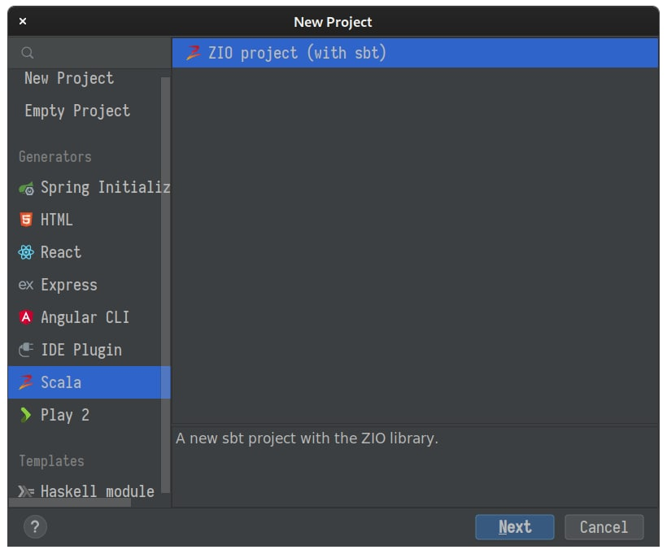

## Introduction

IntelliJ IDEA is a popular IDE for Java developers. It is a powerful tool for developing Java applications. Fortunately, not only does it support the Java language, but it also supports many other languages, including Scala.

## Prerequisites

We assume that the reader has already installed IntelliJ IDEA. To download the latest version of IntelliJ IDEA, visit [IntelliJ IDEA download page](https://www.jetbrains.com/idea/download/).

## Installing Scala and ZIO plugins

To add the Scala support for IntelliJ IDEA, we need to install the [Scala plugin](https://plugins.jetbrains.com/plugin/scala). This plugin supports projects that are written in Scala along with the SBT build tool like the ZIO projects.

Besides the Scala plugin, in this tutorial we will also use the [ZIO plugin](https://plugins.jetbrains.com/plugin/zio), to create a new ZIO project from predefined templates.

Both of these plugins are available in the IntelliJ IDEA marketplace. We should follow these steps:
1. Open the IntelliJ IDEA settings by pressing the _Ctrl+Alt+S_ key combination.
2. Click on the _Plugins_ tab.
3. Click on the _Marketplace_ tab.
4. Search for the _Scala_ plugin and click on the _Install_ button.
5. Search for the _ZIO for IntelliJ_ plugin and click on the _Install_ button.
6. Finally, we might need to restart IntelliJ IDEA.

## Creating a New Project

To create a new ZIO project, we will use the _ZIO for IntelliJ_ plugin. This plugin provides a new project template that we can use to create a new ZIO project.

First, click on the _File > New > Project ..._ menu. This will open a dialog that lets us choose the project type:



Then, we can choose the _ZIO project (with sbt)_ project type. It will create a new ZIO project with the sbt build tool:


It asks us to choose the project name, its location, the ZIO version and other related settings. After entering the project details, we can click on the _Create_ button:

It will create a new ZIO project and open it in the IntelliJ IDEA. From here, we can start working on the project.

## Running the Application

IntelliJ IDEA provides a green run button beside any classes that is executable. So if we open the `src/main/scala/Main.scala` file, we can see the run button. By clicking on that we can see that the IntelliJ IDEA start to compile and run the `Main` class.

> **_Note:_** 
> 
> At the time of writing this tutorial, the _ZIO for IntelliJ_ doesn't provide a right template for ZIO 2.x projects. So let's write our own Main class:
>
> ```scala
> import zio._
> 
> object Main extends ZIOAppDefault {
>   def run = Console.printLine("Hello, world!")
> }
> ```

## Running ZIO Tests

IntelliJ IDEA can run tests in the `test` directory. Let's create a new test class `ExampleSpec` and add it to the `src/test/scala` directory:

```scala mdoc:compile-only
import zio.test._

object ExampleSpec extends ZIOSpecDefault {
  def spec =
    suite("spec")(
      test("test1") {
        assertTrue(true)
      },
      test("test2") {
        assertTrue(false)
      }
    )
}
```

The IntelliJ IDEA detects the tests and places a run button beside them. So we can click on the run button, and it will run the tests:


## Conclusion

In this tutorial, we have learned how to create a new ZIO project in IntelliJ IDEA. Then we learned how to run ZIO applications and ZIO tests in IntelliJ IDEA.
