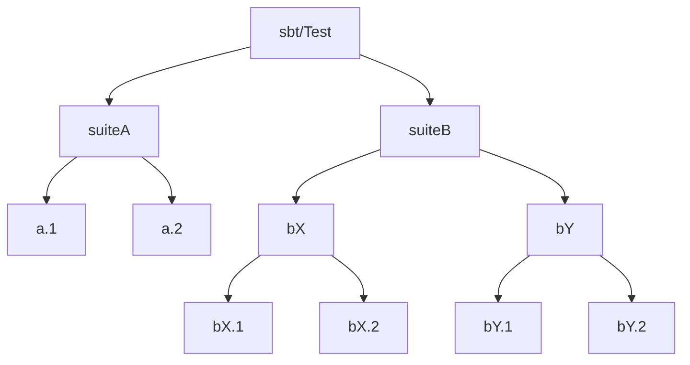

JUnit limitations

    - XML - Are you using XML for anything *besides* junit results?

    https://www.ibm.com/docs/en/developer-for-zos/14.1?topic=formats-junit-xml-format

zio-test-reports
    JSON
        Everyone knows to interact with or, at least, read it

Annotation-specific treatment

Test Reports VS console streaming
Sample test structure

Tracking and reporting catastrophes

    - OOM
    - CI cancellation

  It's not enough to check the console, because we capture and only print output when it will make sense.
  

TODOS:
    - Start producing CSV results
    - Load simple test results file into a spreadsheet/chart/etc
    